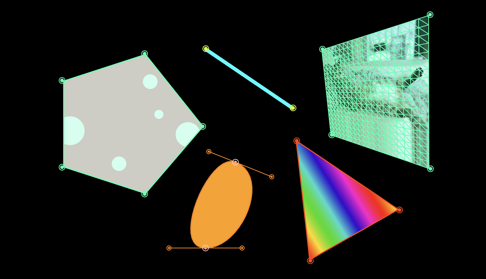

# p5.mapper

p5.mapper is a projection mapping library for [p5.js](https://p5js.org/). This library makes it easy to code and keystone interactive, algorithmic sketches. Created by [Jenna deBoisblanc](https://jdeboi.com/).





## Examples
* [basic](https://editor.p5js.org/jdeboi/sketches/EjUrc7RiP)
* [quads](https://editor.p5js.org/jdeboi/sketches/gPBajTX8Z)
* [lines](https://editor.p5js.org/jdeboi/sketches/v4zMGF-6n)
* [bezier](https://editor.p5js.org/jdeboi/sketches/hqTzdgULE)
* [video](https://editor.p5js.org/jdeboi/sketches/He2_OvO2p)

## Library
You'll find the library, `p5.mapper.min.js`, in the dist folder of this repo. Include the library in your `index.html` (after loading p5.js).

```html
<script type="text/javascript" src="p5.mapper.min.js"></script>
```
  
Alternatively, you can get the library through cdn:  
  
```html
<script src="https://cdn.statically.io/gh/jdeboi/p5.mapper/main/dist/p5.mapper.min.js"></script>
```

## Acknowledgements

The logic of this library builds upon and/or adapts:
* [David Bouchard's (Java) Processing Keystone Library](http://keystonep5.sourceforge.net/)
* [Jenny Louthan, projection transform algorithms](https://github.com/jlouthan/perspective-transform) 

