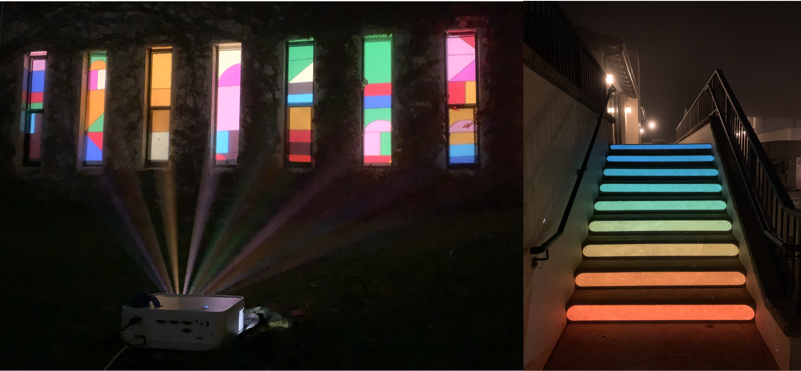
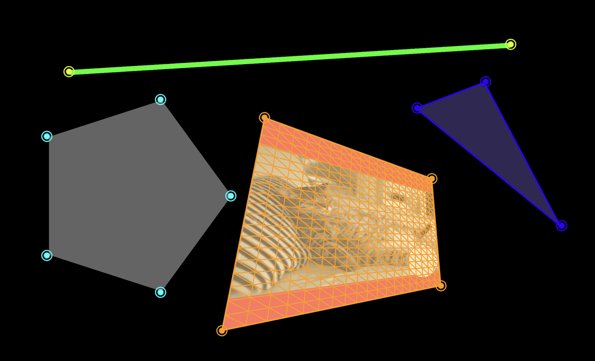

# p5.mapper

p5.mapper is a projection mapping library for [p5.js](https://p5js.org/). This library makes it easy to code and keystone interactive, algorithmic sketches. Created by [Jenna deBoisblanc](https://jdeboi.com/).


* [Examples](examples)
* [Reference](reference/README.md)




You'll find the library, `p5.mapper.min.js`, in the dist folder of this repo. Include the library in your `index.html` (after loading p5.js).

```html
<script type="text/javascript" src="p5.mapper.min.js"></script>
```

Inside the `sketch.js`:
```javascript
const pMapper = createProjectionMapper(this);

// quad, triangle, lines:
const quadMap = pMapper.createQuadMap(400, 400);
const triMap = pMapper.createTriMap(300, 300);
const lineMap = pMapper.createLineMap();

// mask with 6 moveable points
const maskMap = pMapper.createMaskMap(6);

// draw()
quadMap.clear();
quadMap.background(255, 0, 0);
quadMap.fill(255);
quadMap.ellipse(100, 100, 100);

triMap.clear();
triMap.background(255, 255, 0);

lineMap.display(color(0, 255, 0));

maskMap.display();
```

## Acknowledgements

The logic of this library builds upon and/or adapts:
* [David Bouchard's (Java) Processing Keystone Library](http://keystonep5.sourceforge.net/)
* [Jenny Louthan, projection transform algorithms](https://github.com/jlouthan/perspective-transform) 

