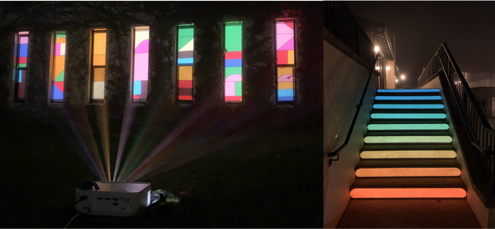
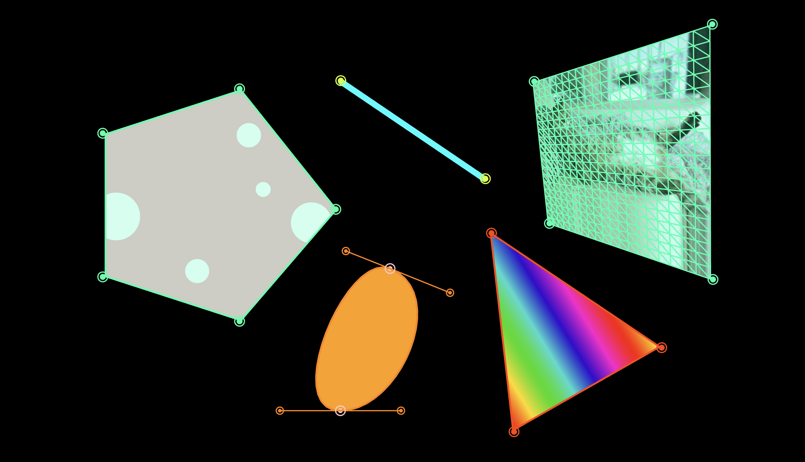

# p5.mapper

p5.mapper is a projection mapping library for [p5.js](https://p5js.org/). This library makes it easy to code and keystone interactive, algorithmic sketches onto quads, triangles, bezier shapes, and LED lines. Created by [Jenna deBoisblanc](https://jdeboi.com/).

**Version 2.2.0** — requires p5.js 2.x. Written in TypeScript.





## Examples
* [basic](https://editor.p5js.org/jdeboi/sketches/EjUrc7RiP)
* [lines](https://editor.p5js.org/jdeboi/sketches/v4zMGF-6n)
* [bezier](https://editor.p5js.org/jdeboi/sketches/hqTzdgULE)
* [video](https://editor.p5js.org/jdeboi/sketches/He2_OvO2p)
* [instance mode](https://editor.p5js.org/jdeboi/sketches/ZYw2zmohn)

## Reference
See [reference/README.md](reference/README.md) for the full API reference.

## Library

The built library is in the `dist/` folder. Include it in your `index.html` after p5.js:

```html
<script type="text/javascript" src="p5.mapper.min.js"></script>
```

Or via CDN:

```html
<script src="https://cdn.jsdelivr.net/gh/jdeboi/p5.mapper/dist/p5.mapper.min.js"></script>
```

## Building from source

```bash
npm install
npm run build
```

## Acknowledgements

The logic of this library builds upon and/or adapts:
* [David Bouchard's (Java) Processing Keystone Library](http://keystonep5.sourceforge.net/)
* [Jenny Louthan, projection transform algorithms](https://github.com/jlouthan/perspective-transform)

