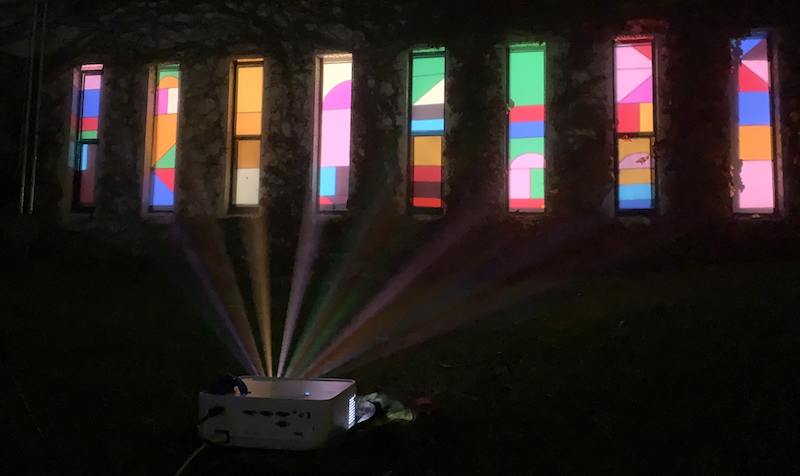
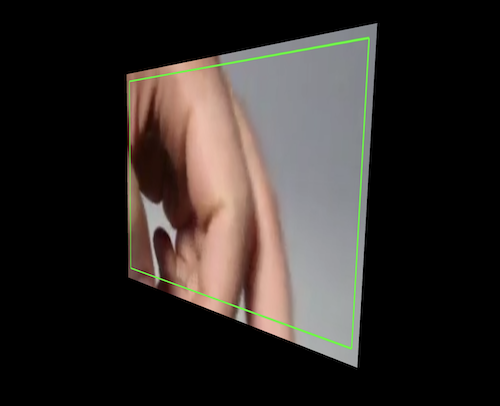

### Examples

<table>
    <tbody>
        <tr>
            <td></td>
            <td>Basic</td>
            <td><a href="https://jdeboi.com/p5.mapper/examples/basic/index.html">demo</a></td>
            <td><a href="https://github.com/jdeboi/p5.mapper/blob/main/examples/basic/sketch.js">code</a></td>
        </tr>
        <tr>
            <td></td>
            <td>Lines</td>
            <td><a href="https://jdeboi.com/p5.mapper/examples/lines/index.html">demo</a></td>
            <td><a href="https://github.com/jdeboi/p5.mapper/blob/main/examples/lines/sketch.js">code</a></td>
        </tr>
        <tr>
            <td></td>
            <td>Quads</td>
            <td><a href="https://jdeboi.com/p5.mapper/examples/quads/index.html">demo</a></td>
            <td><a href="https://github.com/jdeboi/p5.mapper/blob/main/examples/quads/sketch.js">code</a></td>
        </tr>
        <tr>
            <td></td>
            <td>Video</td>
            <td><a href="https://jdeboi.com/p5.mapper/examples/video/index.html">demo</a></td>
            <td><a href="https://github.com/jdeboi/p5.mapper/blob/main/examples/video/sketch.js">code</a></td>
        </tr>
        <tr>
            <td></td>
            <td>Plant Dat</td>
            <td><a href="https://jdeboi.com/p5.mapper/examples/plant_dat/index.html">demo</a></td>
            <td><a href="https://github.com/jdeboi/p5.mapper/blob/main/examples/plant_dat/sketch.js">code</a></td>
        </tr>
    </tbody>
</table>