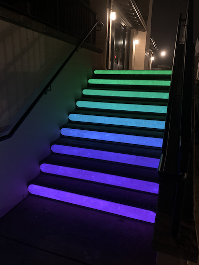

### Examples

<table>
  <tbody>
    <tr>
      <th>Tables</th>
      <th align="center">Are</th>
      <th align="right">Cool</th>
    </tr>
    <tr>
      <td></td>
      <td>Lines</td>
      <td>demo</td>
      <td>code</td>
    </tr>
    <tr>
      <td></td>
      <td>Lines</td>
      <td>demo</td>
      <td>code</td>
    </tr>
  </tbody>
</table>

* Basic
  * [demo](https://jdeboi.com/p5.mapper/examples/basic/index.html)
  * [code](https://github.com/jdeboi/p5.mapper/blob/main/examples/basic/sketch.js)
* Quads
  * [demo](https://jdeboi.com/p5.mapper/examples/quads/index.html)
  * [code](https://github.com/jdeboi/p5.mapper/blob/main/examples/quads/sketch.js)
  * ![]
* Lines
  * [demo](https://jdeboi.com/p5.mapper/examples/lines/index.html)
  * [code](https://github.com/jdeboi/p5.mapper/blob/main/examples/lines/sketch.js)
* Video
  * [demo](https://jdeboi.com/p5.mapper/examples/video/index.html)
  * [code](https://github.com/jdeboi/p5.mapper/blob/main/examples/video/sketch.js)
* Plant Dat
  * [demo](https://jdeboi.com/p5.mapper/examples/plant_dat/index.html)
  * [code](https://github.com/jdeboi/p5.mapper/blob/main/examples/plant_dat/sketch.js)
